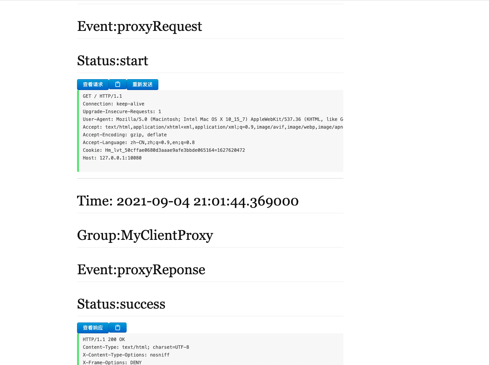
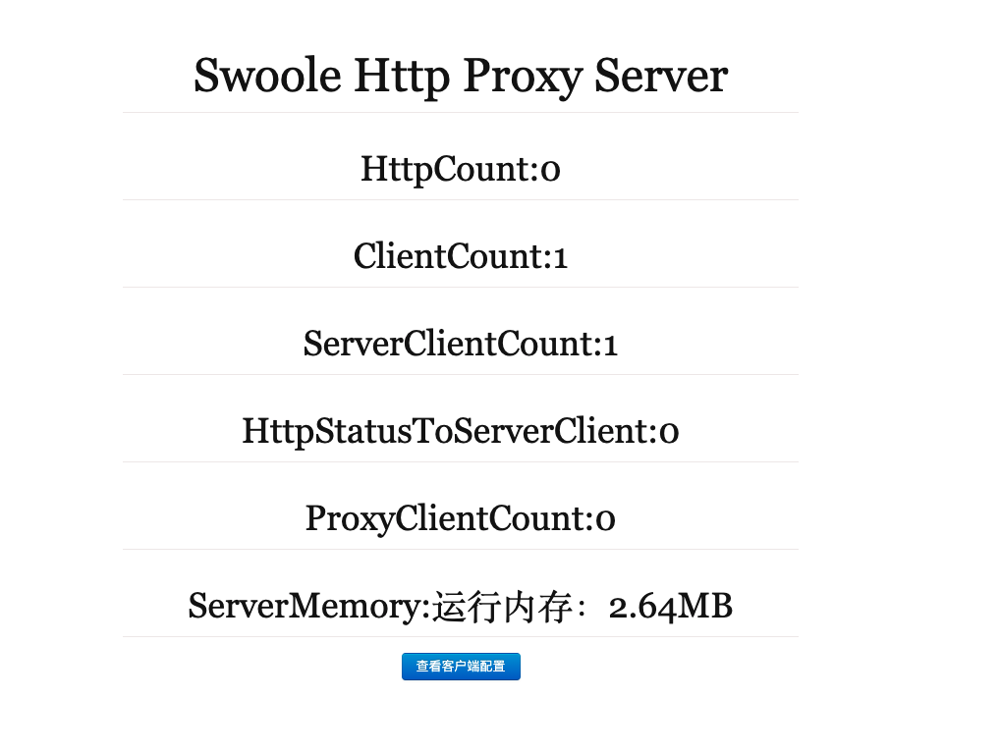

## Http  penetrate


* swoole 实现了客户端和服务端
* go 刚开使用，只实现了服务端(支持php客户端连接)
* 客户端可查看请求，及重新发送请求

## swoole

```
pcel install swoole
```

## client 

在本地运行

```
php proxy_client.php
```
[http://127.0.0.1:7400](http://127.0.0.1:7400)



## swoole server



打开 9502 和9503 端口

在有公网服务器上运行


```
php proxy_server.php
```

简单的后台运行
```
nohup php proxy_server.php &
```

关闭服务端
```
ps -aux | grep proxy_server.php

找到 pid

kill -9 pid
```

 ## go server

 ```
 go run main.go
 ``` 


 ## 如何80 端口访问

 ```
 server {
    listen 80;
    server_name  yourdomain.com;//你自己的域名

    location / {
      proxy_pass http://xxxx:9503;//填写终端输出的域名或者你自己的域名
      proxy_set_header    Host             $host;#保留代理之前的host
      proxy_set_header    X-Real-IP        $remote_addr;#保留代理之前的真实客户端ip
      proxy_set_header    X-Forwarded-For  $proxy_add_x_forwarded_for;
      proxy_set_header    HTTP_X_FORWARDED_FOR $remote_addr;#在多级代理的情况下，记录每次代理之前的客户端真实ip
#      proxy_redirect      default;#指定修改被代理服务器返回的响应头中的location头域跟refresh头域数值

    }
    access_log /var/log/nginx/yourdomain.access.log;
    error_log  /var/log/nginx/yourdomain.error.log;
}

 ```


 ## 2021-09-14 更新

支持tcp 穿透

 * proxy_client.php 是  proxy_tcp_client.php 的子集
 * proxy_server.php 是  proxy_tcp_server.php 的子集

tcp 穿透服务器要开启9504 端口，端口和客户端端口是一对一的关系，即一盒tcp端口，只能代理一个tcp客户端。

要支持多个的话，服务器就要开启多个端口,配置了多个相同的端口的话，优先找到第一个。

客户端
```
php proxy_tcp_client.php
```

服务端
```
php proxy_tcp_server.php
```
